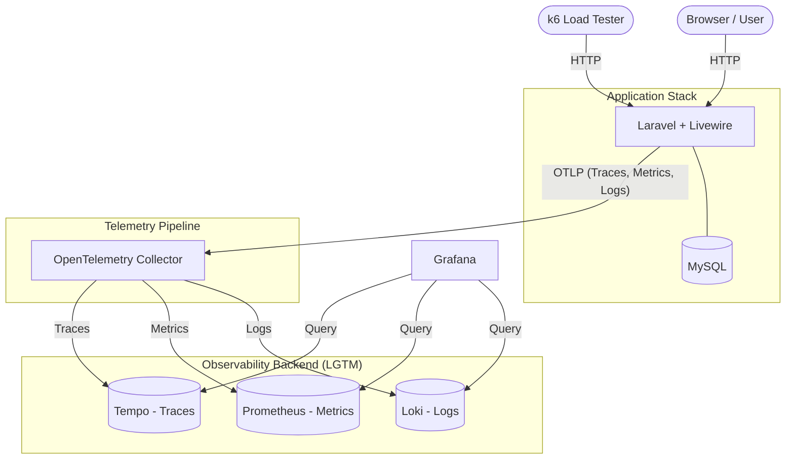

# Hackathon Observability Architecture & Roadmap

## 1. Simple Architecture Diagram



## 2. Folder Structure

Keep it simple but organized for a Docker-heavy environment.

```text
hackathon-obz/
├── app/                  # Laravel application code
├── config/               
├── database/            
├── docker/               # Docker & Observability configs
│   ├── app/              # PHP & Nginx Dockerfiles
│   ├── grafana/          # Provisioning (dashboards, datasources)
│   ├── loki/             # loki-config.yaml
│   ├── prometheus/       # prometheus.yml
│   ├── tempo/            # tempo.yaml
│   └── otel/             # otel-collector-config.yaml
├── k6/                   # Load testing scripts
│   └── scenarios.js      
├── routes/               
├── .env                  
└── docker-compose.yml    # Single compose file to spin everything up
```

## 3. Development Roadmap (8 Hours)

A focused plan to ensure you don't get stuck configuring pipelines all day.

- **Hour 1: Foundation (App + DB)**
  - Initialize Laravel 11 + Livewire.
  - Setup basic `docker-compose.yml` (App + MySQL).
  - Scaffold a simple model (e.g., `Order` or `Ticket`) with migrations.
- **Hour 2: UI & Features (Livewire PowerGrid)**
  - Implement a basic CRUD interface using Livewire PowerGrid to have realistic DB queries and UI renders.
  - Seed 1000+ random records for the grid.
- **Hour 3-4: Bootstrapping Observability Backend**
  - Add OTEL Collector, Prometheus, Loki, Tempo, and Grafana to `docker-compose.yml`.
  - Configure Grafana data sources via provisioning so they auto-connect on boot.
- **Hour 5: Instrumentation (Laravel -> OTEL)**
  - Install OpenTelemetry PHP packages.
  - Configure Laravel to send OTLP Traces, Metrics, and JSON Logs to the OTEL Collector.
  - Ensure **Log Context includes `trace_id`**.
- **Hour 6: Grafana Dashboards**
  - Build a Unified Dashboard: RED metrics (Rate, Error, Duration) at the top, latest logs in the middle, and top 5 slowest traces at the bottom.
  - Link Loki logs directly to Tempo traces via Grafana's "Derived Fields".
- **Hour 7: k6 Load Testing**
  - Write a k6 script to hit the Livewire PowerGrid endpoints (filtering, sorting, paginating).
  - Run k6 to saturate the application and generate beautiful telemetry data.
- **Hour 8: Tuning & Demo Prep**
  - Add intentional bottlenecks (e.g., `sleep(1)` or N+1 queries) to demonstrate tracing capabilities.
  - Verify seamless drill-down: Dashboard Issue ➡️ Slow Trace ➡️ Error Log ➡️ Exact line of code.

## 4. Key Observability Strategy

- **Unified OTLP Transport:** Avoid sending metrics directly to Prometheus, logs to Loki, etc. Send **everything** to the OpenTelemetry Collector via OTLP. Let the Collector handle routing to the various backends.
- **Correlation is the Goal:** Your "Wow" factor in the hackathon will be the ability to click on a slow request in a dashboard, see the distributed trace, and instantly see the specific logs attached to that exact trace ID.
- **Auto-Instrumentation First:** Rely heavily on PHP OpenTelemetry auto-instrumentation hooks (PDO, cURL, Laravel framework events) to capture the bulk of data automatically, minimizing manual code changes.
- **Emphasize the "Why":** Observability isn't about collecting data; it's about answering questions. Design your dashboard to answer: *"Is the app healthy?"* and *"Why is it slow?"*

## 5. What Metrics, Logs, and Traces to Capture

### Metrics (Focus on RED Method)
- **HTTP Request Rate:** Total requests per second.
- **Error Rate:** Percentage of HTTP 5xx and 4xx responses.
- **Duration (Latency):** 95th and 99th percentile response times for your Livewire endpoints.
- **MySQL Connection Pool & Query Execution Time:** Average DB response times.
- **Infrastructure:** Docker container CPU and Memory usage (easily captured via cAdvisor or Otel host metrics, though optional if strapped for time).

### Logs (Structured & Actionable)
- **JSON Format Only:** Output all logs as JSON.
- **Must Include Context:** `trace_id`, `span_id`, `user_id`, and `url`.
- **Key Events to Log:**
  - Application Exceptions / Warnings.
  - Complex state changes (e.g., "Livewire PowerGrid filter applied: {filter_data}").
  - Unauthorized access attempts or validation failures.

### Traces (The Story of a Request)
- **HTTP Span:** Start a span when the request hits Laravel, end it when the response is sent.
- **Database Spans:** Auto-capture every SQL query. You want to easily visualize N+1 query problems in Tempo.
- **Livewire Component Spans:** Create custom spans for the `render` method of your heavy Livewire components.
- **External API Calls:** If your app makes any outgoing API calls, trace them.
